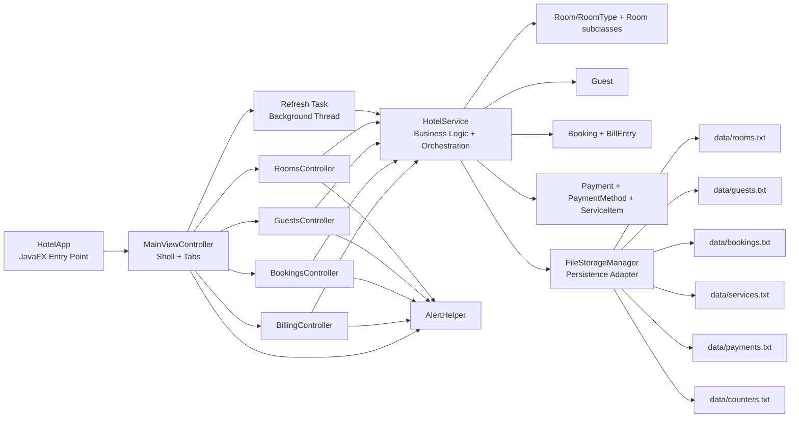
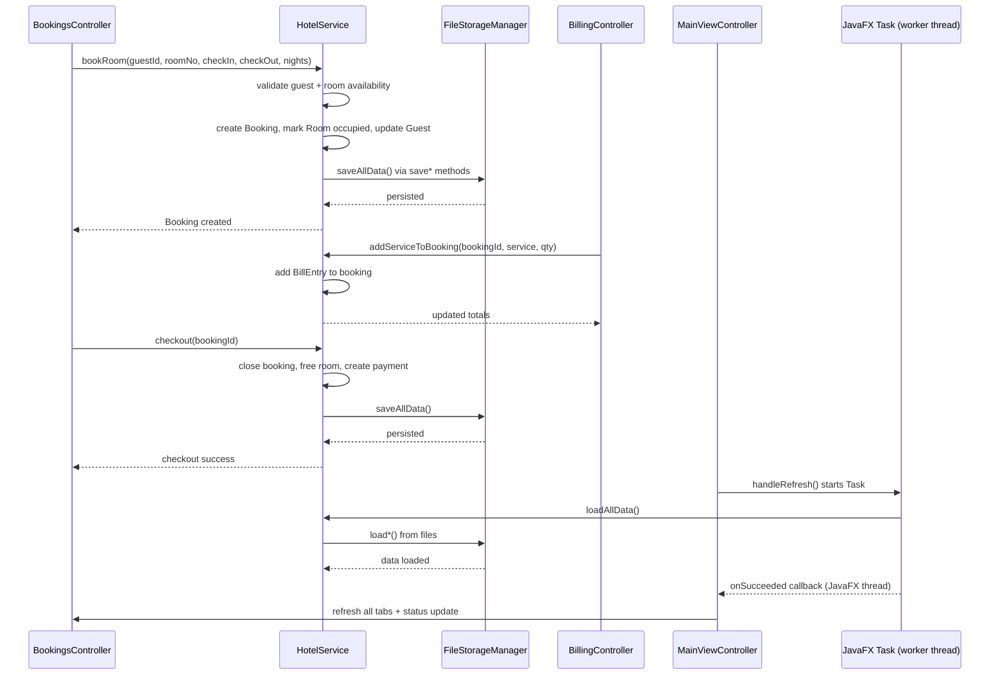
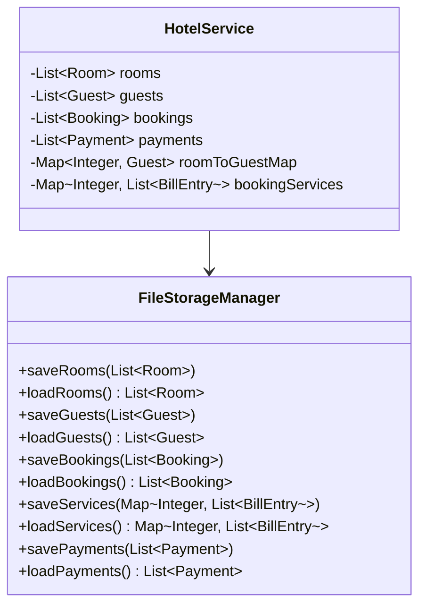

# Hotel Management System - Diagram First Architecture

## 1. High-level Architecture Diagram

Note: `MainViewController.handleRefresh()` runs `HotelService.loadAllData()` in a JavaFX `Task` on a daemon worker thread (`hotel-refresh-thread`), then updates UI in `setOnSucceeded` / `setOnFailed`.

## 2. Sequence Diagram - Booking to Checkout

## 3. Component responsibilities (quick view)
- `HotelApp`: Starts JavaFX and creates the main view.
- `MainViewController`: Tab shell and global actions (refresh/about/exit).
- `RoomsController`: Room CRUD + availability filtering.
- `GuestsController`: Guest registration/deletion + display.
- `BookingsController`: Reservation + checkout workflow.
- `BillingController`: Service additions + bill generation.
- `HotelService`: Domain rules and state consistency across entities.
- `FileStorageManager`: Reads/writes all text file records.
- `AlertHelper`: Centralized alert/dialog handling and theming.

## 4. Data structures and generics diagram

## 5. Concepts used map
- OOP: abstraction (`Room`), inheritance (room subclasses), polymorphism (`calculateTariff`), encapsulation (model fields), interface (`Amenities`).
- Java Collections + Generics: `List<T>`, `ArrayList<T>`, `Map<K,V>`, `HashMap<K,V>`.
- JavaFX typed UI controls: `ObservableList<T>`, `TableView<T>`, `TableColumn<T,U>`, `ComboBox<String>`.
- Persistence pattern: model-level `toFileString()/fromFileString()` plus storage adapter.
- Thread safety: synchronized mutators in service/storage.
- Multithreading: JavaFX background `Task` for menu refresh to avoid UI blocking during file I/O.

## 6. Function-purpose map pointer
For complete function-by-function purpose explanations, refer to:
- `APPLICATION_ARCHITECTURE.md`
- `APPLICATION_ARCHITECTURE_VIVA_NOTES.md`
